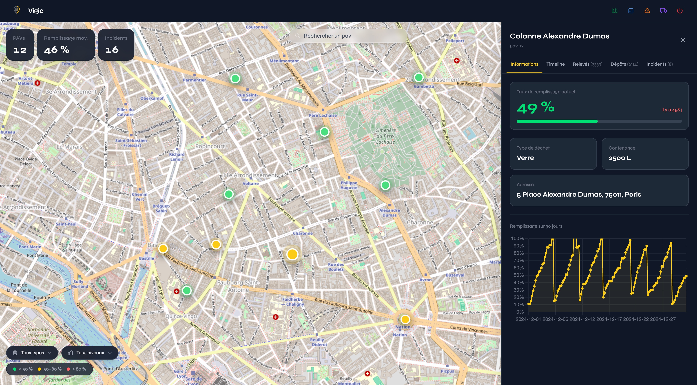
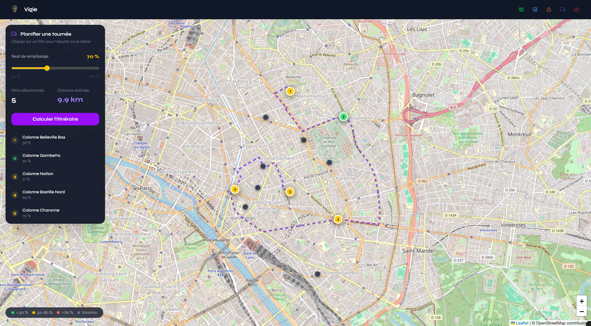

# Vigie — Gestion de parc PAV

Dashboard de suivi et de planification pour agents municipaux : Points d'Apport Volontaire, incidents, statistiques et tournées optimisées.

**https://vigie-38yb.onrender.com/**




---

## Fonctionnalités

| Fonctionnalité           | Description                                                                                                                                           |
| ------------------------ | ----------------------------------------------------------------------------------------------------------------------------------------------------- |
| Carte interactive        | Marqueurs colorés par taux de remplissage, filtres par type de déchet et niveau, recherche par nom ou identifiant, panneau latéral PAV en Turbo Frame |
| Panneau PAV              | 4 onglets (timeline unifiée, capteurs, dépôts, incidents), graphique d'évolution Chart.js sur 30 jours, indicateur de fraîcheur des données           |
| Gestion des incidents    | Liste filtrée par statut, PAV et date, résolution/réouverture avec confirmation, édition de note en Turbo Stream, export CSV                          |
| Statistiques             | 5 graphiques Chart.js : évolution du remplissage 30 jours, répartition par type de déchet, incidents mensuels, top PAVs actifs et problématiques      |
| Planification de tournée | Carte Leaflet, slider de seuil (50–100 %), routing OSRM sur routes réelles, polyline animée, liste ordonnée des PAVs avec distance totale             |

---

## Stack

| Catégorie                 | Outil                                     |
| ------------------------- | ----------------------------------------- |
| Framework                 | Ruby on Rails 8.0                         |
| Base de données           | PostgreSQL (jsonb)                        |
| Frontend                  | Tailwind CSS, Hotwire (Turbo + Stimulus)  |
| Carte                     | Leaflet.js + OpenStreetMap (sans clé API) |
| Graphiques                | Chart.js                                  |
| Auth / Forms / Pagination | Devise, Simple Form, Pagy                 |
| Routing tournées          | OSRM (router.project-osrm.org)            |
| Déploiement               | Render                                    |

---

## Modèle de données

```
pavs   — identifiant métier, nom, adresse, coordonnées GPS, type de déchet, capacité
logs   — tous les événements en une seule table : sensor_reading, badge_deposit, incident
         via event_type + payload jsonb — absorbe 3 structures incompatibles sans nullable column sprawl
users  — authentification Devise (email + mot de passe)
```

Le choix `jsonb` pour le payload est délibéré : les trois types d'événements ont des structures incompatibles. Une table par type aurait généré du nullable column sprawl ; trois tables séparées auraient compliqué les requêtes transversales. `jsonb` est honnête sur cette variabilité et reste nativement requêtable par PostgreSQL.

---

## Setup local

**Prérequis** : Ruby >= 3.2, PostgreSQL, le fichier `pav_logs.json` à la racine du projet (fourni avec l'énoncé du test technique).

```bash
# 1. Installer les dépendances
bundle install

# 2. Créer et migrer la base
rails db:create db:migrate

# 3. Importer les données
rake import:logs

# 4. Lancer le serveur
rails server
```

La rake task `import:logs` est idempotente — elle peut être relancée sans créer de doublons.

**Déploiement Render** : `bin/render-build.sh` enchaîne automatiquement bundle, assets:precompile, db:migrate et rake import:logs. Variables d'environnement requises : `DATABASE_URL`, `RAILS_MASTER_KEY`.

---

## Tests

La suite Minitest couvre les validations et scopes des modèles (Pav, Log, User), les 4 controllers (pavs, incidents, stats, tours), les flux système principaux (authentification, carte, incidents) et la tâche d'import.

```bash
rails test
```

---

## Usage de l'IA

**Outil utilisé** : Claude Code (claude-sonnet-4-6) via CLI, avec un `CLAUDE.md` rédigé en amont pour contraindre la stack, le style de code et les conventions du projet.

**Ce que l'IA a assisté** : planification et priorisation des fonctionnalités, boilerplate Tailwind (composants UI répétitifs), configuration Devise, squelettes de migrations, écriture des tests Minitest, configuration Render, ce README. Des skills d'audit et de revue de code ont été utilisés régulièrement pour identifier les incohérences et les régressions.

**Ce que j'ai décidé et arbitré** :

- Modèle de données : Pav + Log avec payload jsonb plutôt que tables séparées par type d'événement
- Stratégie d'import : rake task idempotente avec upsert, gestion des dates imparfaites (fallback datetime → date + minuit)
- Choix de Leaflet + OSM, OSRM, Hotwire — et ce qu'on n'a pas pris (Mapbox, React, Active Storage)
- Tous les scopes ActiveRecord et les requêtes jsonb PostgreSQL
- Architecture Stimulus : un controller par comportement JS justifié, rien de plus
- Lecture et validation de chaque fichier généré avant commit — tout le code est explicable ligne par ligne
